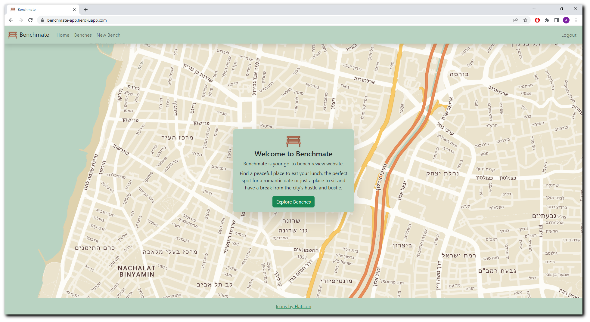
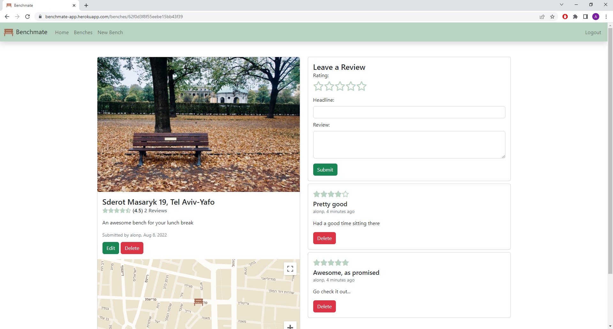

# Benchmate
> A bench review web app built in Express stack.
> Live demo [here](https://benchmate-app.herokuapp.com/).

## Table of Contents
* [General Info](#general-information)
* [Technologies Used](#technologies-used)
* [Features](#features)
* [Screenshots](#screenshots)
* [Setup](#setup)
* [Usage](#usage)
* [Acknowledgements](#acknowledgements)


## General Information
Benchmate is a web app where users can add and review public benches. Additionally, users can explore benches on a map and sort benches by different criteria. This app was built as a final project in Colt Steele's [Web Developer Bootcamp](https://www.udemy.com/course/the-web-developer-bootcamp/) on Udemy. It encourages people to share their favorite spots in their city and take ownership of the city's public space.


## Technologies Used
- HTML
- CSS
- JavaScript
- Bootstrap
- MongoDB, Mongoose
- Node.js
- npm
- Express
- Deployed on Heroku


## Features
- CRUD operations with RESTful routes
- Extensive error handling and data validation
- Local authentication and authorization with Passport
- Fully responsive design
- Forward geocoding with Google Maps API
- Customized map with Google Maps JavaScript API
- Geospatial queries with MongoDB
- Image upload on Cloudinary


## Screenshots
<p align="center">
  
</p>
<p align="center">
  
</p>
<p align="center">
  
</p>


## Setup
To run locally:
1. Install [MongoDB](https://www.mongodb.com/).
2. Create a [Cloudinary](https://cloudinary.com/) account to get an API key and secret code.
3. Create a [Google Maps Platform](https://mapsplatform.google.com/) account to get an API key.
4. Run the following commands:
```
git clone https://github.com/alon-pilosoph/benchmate.git
cd benchmate
npm install
```
5. Create a .env file in the root of the project and add the following:  
```
CLOUDINARY_CLOUD_NAME=<name>
CLOUDINARY_KEY=<key>
CLOUDINARY_SECRET=<secret>
MAPS_API_KEY=<key>
DB_URL=<url>
```


## Usage
1. Run ```mongod```
2. From within the project's root folder, run: ```node app.js```
3. Visit [localhost:3000](http://localhost:3000/).

Users need to be registed and logged in to add new benches or review existing ones. Go to 'Register' to create an account.\
Once registered and logged in, go to 'New Bench' to add a new bench. You can also review a specific bench by navigating to its page.


## Acknowledgements
- This project is an implementation and expansion of YelpCamp, the final project in Colt Steele's [Web Developer Bootcamp](https://www.udemy.com/course/the-web-developer-bootcamp/) on Udemy.
- It was inspired by a [Facebook group](https://www.facebook.com/tlvbench/) dedicated to review benches in Tel Aviv.
